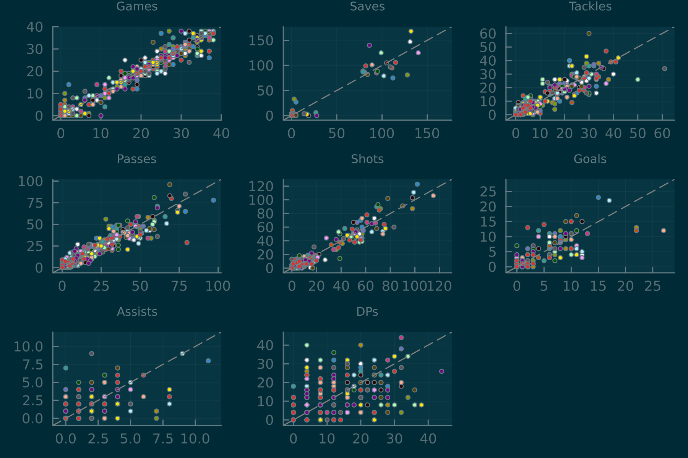

# SoccerManager.jl
A performant soccer simulator for gaming and ML. 

Ported from [ESMS](https://github.com/eliben/esms).

## Installation
```
# After cloning/downloading repo
# Start Julia REPL (note the threads and optimization arguments)
user@pc:~/path/to/package$ julia --threads=2 -O3

# Enter the package manager REPL using the closing square bracket
julia> ]

# Activate the SoccerManager package
(@v1.11) pkg> activate .
  Activating project at `~/path/to/package`

# Check package status. It should look like this (also note the new prompt):
(SoccerManager) pkg> status
Project SoccerManager v0.1.0
Status `~/path/to/package/Project.toml`
  [7d9f7c33] Accessors
  [a93c6f00] DataFrames
  [31c24e10] Distributions
  [1fa38f19] Format
  [842dd82b] InlineStrings
  [d96e819e] Parameters
  [f517fe37] Polyester
  [90137ffa] StaticArrays
  [2913bbd2] StatsBase
  [f3b207a7] StatsPlots
  [b8865327] UnicodePlots

# Instantiate the package (download the dependencies)
(SoccerManager) pkg> instantiate

# Return to the normal REPL with backspace
(SoccerManager) pkg> [backspace]
```

### Set up data directory
Next navigate to the (examples/playgames.jl) script, change `path_dest` to an appropriate location for the data directory, and paste the first few lines into the REPL. This will copy default roster/etc files into the chosen directory:
```
julia> using InlineStrings

julia> using SoccerManager

julia> import SoccerManager: update_roster, lgrank!

       ############################
       ### Set up paths/configs ###
       ############################

       # Copy default roster/etc files from package into chosen data directory
       # The directory will be created if it doesn't exist or can be overwritten by setting force = true
       # WARNING: Overwriting the directory will delete all the contents
       # A tuple of useful paths is also returned

julia> path_dest = "/home/user/Documents/SoccerManagerData"
"/home/user/Documents/SoccerManagerData"

julia> paths     = init_user_data_dir(path_dest, force = false);
New data directory created at: /home/user/Documents/SoccerManagerData/data
```

Now the example scripts can be run. First, also change the data directory path in those scripts to the same one used above. Eg:

```
path_dest = "/home/user/Documents/SoccerManagerData"
```

Next time Julia is started use the `--project` argument to automatically activate the environment:
```
user@pc:~/path/to/package$ julia --project=. --threads=2 -O3
```

## Examples
### [benchmarks.jl](examples/benchmarks.jl)
- Benchmarks for the highest-level functions (eg, reading/writing league data from file or playing an entire season)

### [playgames.jl](examples/playgames.jl)
- Demonstrates how to play a single game  to an entire season at once

### [fitratings.jl](examples/fitratings.jl)
- Demonstrates a simple threshold acceptance algorithm for using season-level stats to optimize player ratings

## Tips
### Multi-threading
- The `@multi` macro defined in [SoccerManager.jl](src/SoccerManager.jl) can be used to switch between multi-threading libraries at compile time. Use `@batch` unless nesting multiple multi-threaded loops (then use `@threads`).
- Set the `--threads` command-line argument to the number of physical cores, not threads
- A league of 20 teams can play only 10 games in parallel, so unless nesting inside an outer loop only 10 threads are needed

## Benchmarks
#### System Specs
```
Julia Version 1.11.2
Commit 5e9a32e7af2 (2024-12-01 20:02 UTC)
Build Info:
  Official https://julialang.org/ release
Platform Info:
  OS: Linux (x86_64-linux-gnu)
  CPU: 64 × AMD Ryzen Threadripper 2990WX 32-Core Processor
  WORD_SIZE: 64
  LLVM: libLLVM-16.0.6 (ORCJIT, znver1)
Threads: 32 default, 0 interactive, 16 GC (on 64 virtual cores)
```
#### Single game
`50.991 μs (0 allocations: 0 bytes)`
#### Season with 20 teams (38 games each)
- `@threads:` `13.545 ms (6231 allocations: 850.22 KiB)`
- `@batch  :` `5.211  ms (113  allocations: 29.06 KiB)`

## ML Benchmarks


## TODO
1. Minute-by-minute game log
2. Halftime (added minutes)
3. Activate "abilities" (ratings update during the season due to in-game performance)
4. Improve tactics/teamsheet AI
5. Add situations (planned/conditional subs and tactics)
6. Unit tests
7. Get real-life data
8. More ML algorithms
9. Run on GPU
10. Multiple leagues in parallel
11. Multiple seasons sequentially
12. Simulate transfer market activity
